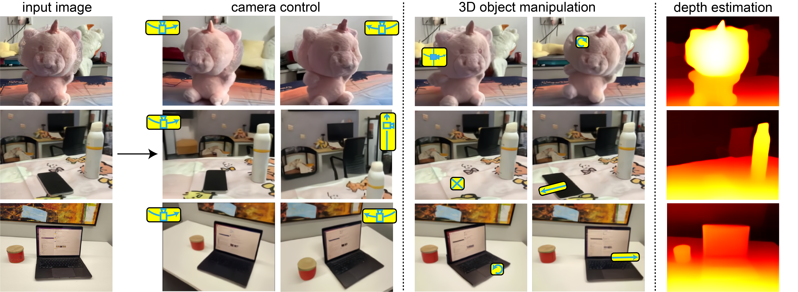

# 3D Scene Understanding Through Local Random Access Sequence Modeling (LRAS)



<!-- ## Table of Contents
- [Installation](#installation)
- [Usage](#usage)
- [License](#license) -->

## Installation
See [Installation.md](Installation.md) for detailed installation instructions.

## Checkpoints
You can download the checkpoints using [download_checkpoints.sh](download_checkpoints.sh)

Please put the checkpoints/ dir in the repo dir: <lras_3d>/checkpoints/

## Usage
This repo provides the example codes for Novel View Synthesis, 3D Object Manipulation, and Depth Estimation.

### Novel View Synthesis
```bash
python run_nvs.py
```

### 3D Object Manipulation
```bash
python run_object_motion.py
```

### Depth Estimation
```bash
python run_depth.py
```

## Changelog
- [x] First release of the repo with basic NVS, 3D Object Motion, Depth Estimation capability

## License
This repository is licensed under the MIT License.
See the LICENSE file for details.

## Citation
